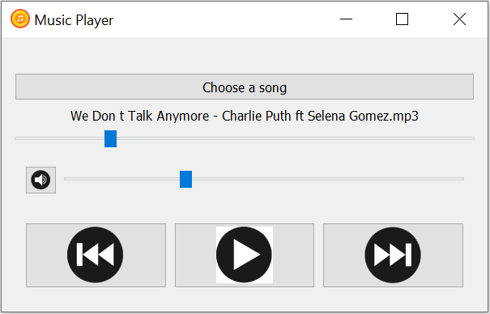

# Music_Player
### About the App
A Music Player created with Pyqt5 GUI. You can choose a song from a folder and play it, the song's name will be presented on the screen. You can also pause the song while it's running, move the song toward and backward, and modify the volume. I still need to figure out how to handle the buttons to move to the next song or previous song. If you have an idea, feel free to contribute to this app! 
### Screenshot
This is how the app looks like:

### Try it!
You can download the game (Music_Player.zip)from [Release](https://github.com/socolachaymo/Music_Player/releases/tag/0.0) and run the Music_Player.exe file
